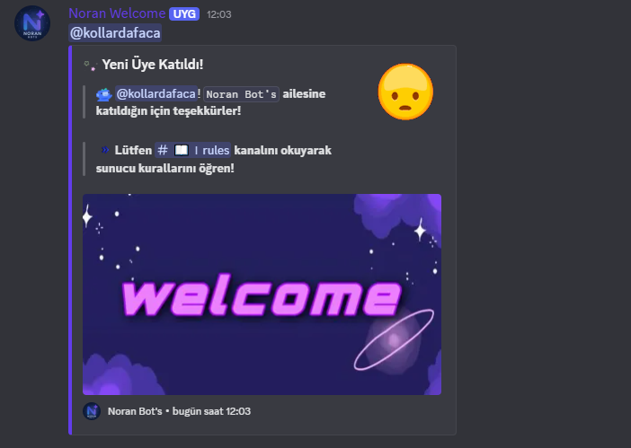

<h1 align="center">🎉 Noran Welcome Bot 🎉</h1>

  <b>Discord sunucunuza sıcak bir dokunuş katın!</b> 
  Modern, kullanıcı dostu ve özelleştirilebilir bir hoşgeldin botu ile yeni üyelerinizi etkileyin.

---

## 🌟 Özellikler

✅ **Özelleştirilebilir Hoşgeldin Mesajları**  
• Kişiselleştirilmiş içerikler  
• Banner desteği  
• Emoji entegrasyonu  
• Dinamik değişkenler (örn. `{member}`, `{created_at}`)

🛡️ **Gelişmiş Güvenlik Sistemi**  
• Hesap yaşı kontrolü  
• Güvenlik seviyesi belirleme  
• Şüpheli kullanıcı tespiti

📝 **Detaylı Loglama**  
• Üye giriş logları  
• Hesap bilgileri & güvenlik durumu  
• Otomatik rol kayıtları

🎭 **Otomatik Rol Verme**  
• Yeni gelen üyelere otomatik rol  
• Tamamen özelleştirilebilir yapı

🤖 Proje Hakkında
Bu proje, kişisel olarak deneme amaçlı hazırlanmış bir altyapıdır. Bot geliştirme konusunda uzman değilim, ancak yapay zeka (ChatGPT gibi araçlar) yardımıyla bazı temel yapılar oluşturmaya çalıştım.
Amacım, GitHub hesabımı aktif tutmak ve öğrendiklerimi belgelemek.
İleride bu projeler üzerinden daha fazlasını öğrenmek ve gelişmek istiyorum.

Katkılarınız, yorumlarınız veya önerileriniz olursa seve seve dinlerim. 🙏

Noran Welcome/welcome.png
